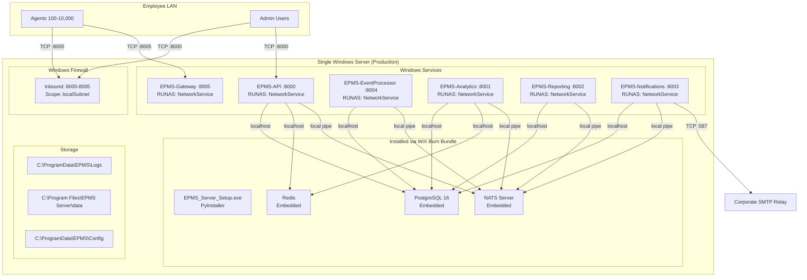
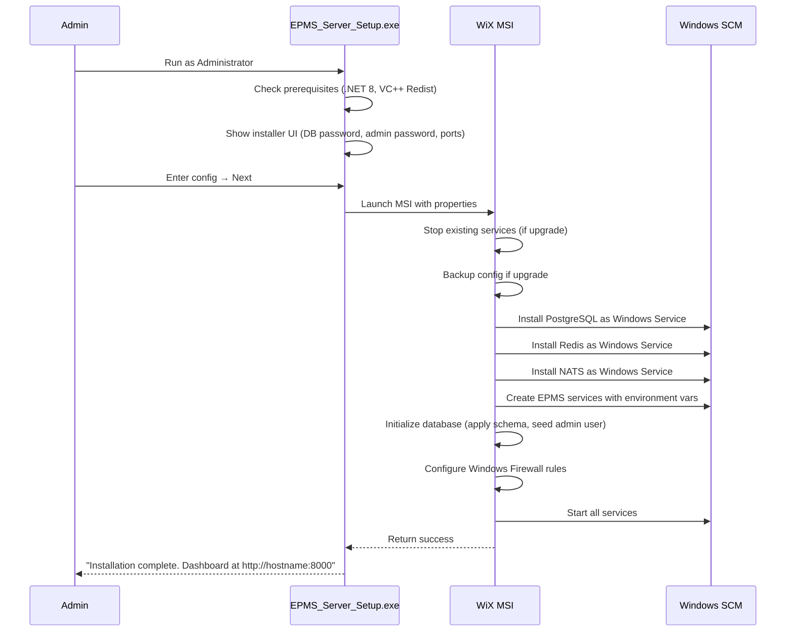

# EPMS Enterprise — Deployment Plan

## 1. Deployment Architecture

### Target Environment

**On-premises Windows Server 2019/2022**. EPMS is designed for air-gapped enterprise networks where employees cannot access external SaaS.



## 2. Platform Selection

**Decision**: Self-hosted VPS / On-prem server

| Criterion | Enterprise On-Prem | Cloud (AWS/GCP) | VPS (Hetzner/DigitalOcean) |
|-----------|-------------------|-----------------|---------------------------|
| Customer requirement | ✅ Required (air-gap) | ❌ Not allowed | ❌ Not allowed |
| Data residency | ✅ Full control | ⚠️ Region-dependent | ⚠️ Jurisdiction-dependent |
| Ops burden | High (self-manage) | Low (managed) | Medium |
| Cost (10K agents) | ~$3K server once | ~$2K/mo | ~$300/mo |
| Compliance | ✅ SOC2 achievable | ⚠️ Shared responsibility | ⚠️ Limited certifications |

**Verdict**: The enterprise on-prem model is the product's differentiator. Build for it.

### Hardware Sizing

| Scale | Agents | vCPU | RAM | Storage (SSD) | Typical Server |
|-------|--------|------|-----|---------------|----------------|
| Small | <500 | 4 | 16 GB | 200 GB | Dell T340, HPE MicroServer |
| Medium | 500-2,000 | 8 | 32 GB | 500 GB | Dell R240, HPE DL20 |
| Large | 2,000-10,000 | 16 | 64 GB | 1 TB | Dell R450, HPE DL360 |
| Enterprise | 10,000+ | 32+ | 128 GB | 2 TB+ NVMe | Dell R750, HPE DL380 |

**Key bottleneck**: IOPS on the database volume. Agent heartbeats (every 30s × agents) + browser events (every 5s per active agent) = up to 2,000 writes/sec at 10K agents. Requires SSD with 10K+ sustained IOPS.

## 3. Deployment Pipeline

### 3.1 Build Pipeline

```yaml
Developer Push → GitHub
  └→ GitHub Actions
       ├─→ Run tests (pytest - all modules)
       ├─→ Run lint (ruff, mypy)
       ├─→ Build PyInstaller .exe (6 server services)
       ├─→ Build agent .exe
       ├─→ Compile WiX .msi (light.exe, candle.exe)
       ├─→ Create WiX Bootstrapper .exe (burn.exe)
       ├─→ Authenticode sign all .exe/.msi
       └─→ Upload to release artifacts
```

### 3.2 Install Flow



### 3.3 Service Recovery Configuration

All services should have Windows SCM recovery configured:

| Attempt | Action | Delay |
|---------|--------|-------|
| 1st failure | Restart service | 10 seconds |
| 2nd failure | Restart service | 30 seconds |
| 3rd failure | Run health-check.ps1 and restart | 60 seconds |
| 4th failure | Leave stopped (manual intervention) | — |

**Reset failure count after**: 24 hours

### 3.4 Service Dependencies (Ordered Startup)

| Service | Depends On | Start Order |
|---------|-----------|-------------|
| PostgreSQL | — | 1 |
| Redis | — | 1 |
| NATS | — | 1 |
| EPMS-EventProcessor | PostgreSQL, NATS | 2 |
| EPMS-Analytics | PostgreSQL, Redis, NATS | 2 |
| EPMS-Notifications | PostgreSQL, NATS | 2 |
| EPMS-API | PostgreSQL, Redis, NATS | 3 |
| EPMS-Gateway | PostgreSQL, NATS | 3 |
| EPMS-Reporting | PostgreSQL, NATS | 3 |

Set `DelayedAutoStart=true` on services in tier 2 and 3 to reduce boot-time CPU spike.

## 4. CI/CD Workflow

### GitHub Actions

```yaml
name: Build and Release
on:
  push:
    tags: ["v*"]
jobs:
  test:
    runs-on: windows-latest
    steps:
      - uses: actions/checkout@v4
      - uses: actions/setup-python@v5
        with: { python-version: "3.10" }
      - run: pip install -e ".[test]"
      - run: python -m pytest tests/ -v --junitxml=results.xml

  build:
    needs: test
    strategy:
      matrix:
        module: [epms-api, epms-analytics, epms-reporting,
                 epms-notifications, epms-event-processor, epms-gateway]
    steps:
      - run: pip install pyinstaller
      - run: pyinstaller services/${{ matrix.module }}.spec
      - uses: actions/upload-artifact@v4
        with:
          name: ${{ matrix.module }}
          path: dist/${{ matrix.module }}/

  build-installer:
    needs: build
    steps:
      - run: choco install wixtoolset
      - run: candle.exe Bundle.wxs ...
      - run: light.exe ...
      - run: signtool.exe sign /fd SHA256 /a EPMS_Server_Setup.exe
      - uses: actions/upload-artifact@v4
        with:
          name: installer
          path: EPMS_Server_Setup.exe
```

## 5. Monitoring and Observability

### Service Health Endpoints

Each service exposes `GET /health` returning:

```json
{
  "status": "ok",
  "service": "epms-api",
  "uptime_seconds": 12345,
  "database": true,
  "redis": true,
  "nats": true,
  "queue_size": 42,
  "active_connections": 156
}
```

The `health-check.ps1` script polls all 6 services and infrastructure.

### Key Metrics to Monitor

| Metric | Source | Warning | Critical |
|--------|--------|---------|----------|
| DB connection pool usage | asyncpg pool | >80% | >95% |
| Event queue length | event processor | >10,000 | >50,000 |
| Agent disconnects/min | gateway | >10 | >50 |
| Heartbeat recency per agent | DB query | >60s | >120s |
| Disk usage (data volume) | WMI | >80% | >95% |
| PostgreSQL replication lag | pg_stat_replication | >10s | >60s |

### Logging

| Level | Detail | Storage |
|-------|--------|---------|
| INFO | Service start/stop, auth success, config load | 30 days |
| WARNING | Auth failure, rate limit hit, reconnection | 90 days |
| ERROR | DB connection failure, unhandled exception, crash | 90 days |
| DEBUG | Agent messages, per-request timing | 7 days (temporary) |

Configure Windows Event Log forwarding to a centralized SIEM (Splunk, Sentinel, etc.)

## 6. Backup and Disaster Recovery

### Backup Schedule

| Data | Frequency | Method | Retention |
|------|-----------|--------|-----------|
| PostgreSQL (full) | Daily 02:00 | `pg_dump -Fc` | 30 days |
| PostgreSQL (WAL) | Continuous | WAL archiving | 7 days |
| Config files | On change | Git + file copy | 30 versions |
| Installer binaries | Per release | GitHub releases | Indefinite |
| Logs | Weekly | Compress + archive | 90 days |

### Recovery Procedures

| Scenario | RTO | RPO | Procedure |
|----------|-----|-----|-----------|
| Service crash | 10s | None | SCM auto-restart |
| Full server failure | 4 hours | <5 min | Restore from backup to standby server |
| Database corruption | 2 hours | <5 min | `pg_restore` from latest dump + WAL replay |
| Accidental data deletion | 1 hour | 24 hours | Point-in-time recovery to before deletion |
| Lost admin password | 30 min | — | Run `setup_db.py` with known password to reset |

### Disaster Recovery Checklist

1. Maintain standby server with identical hardware
2. Replicate WAL logs to standby (or use pgBackRest)
3. Test restore procedure quarterly
4. Document all passwords in company password manager (not in repo)
5. Keep one known-good installer `.exe` offline (safe deposit or cloud backup)
