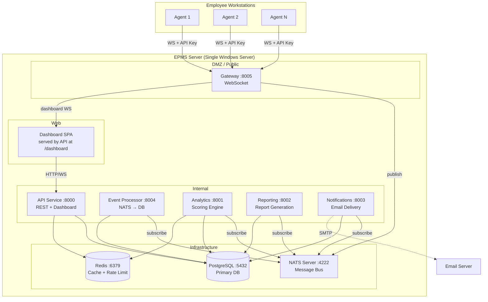
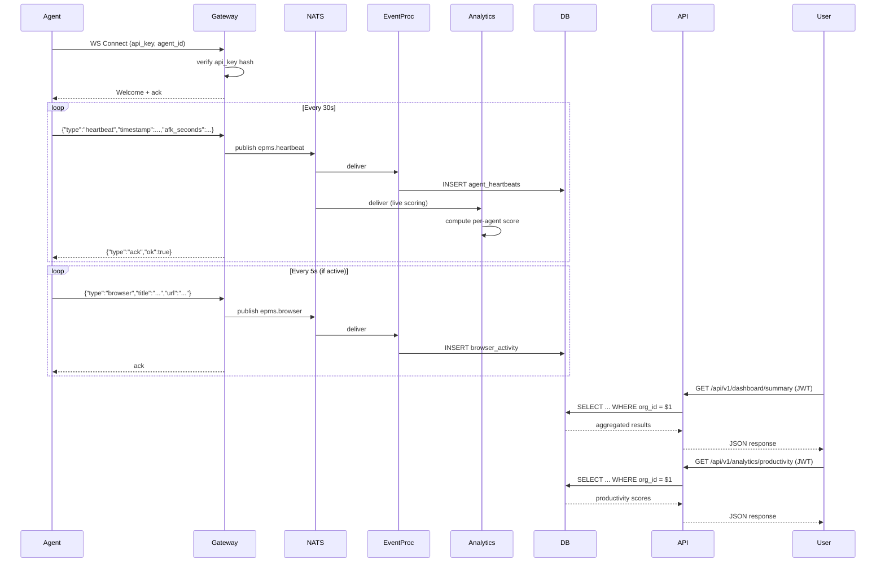

# EPMS Enterprise — System Architecture Design

## 1. Project Overview

EPMS (Enterprise Productivity Management System) is a workforce productivity monitoring platform. It consists of:

- **Agent** — runs on employee workstations; collects window titles, browser URLs, editor activity, AFK state, system metrics
- **Gateway** — real-time WebSocket gateway for agent connectivity (raw RFC 6455 + FastAPI overlay)
- **Event Processor** — NATS consumer → PostgreSQL ingestion pipeline
- **Analytics** — productivity scoring engine (real-time + batch)
- **API** — REST API, JWT auth, dashboard data, agent registration
- **Reporting** — CSV/HTML/JSON report generation, NATS-triggered email delivery
- **Notifications** — SMTP email + in-app notification delivery

**Current state**: Core structure built. ~15 critical security/architecture issues identified in code review. Not production-ready.

## 2. Requirements Analysis

### Functional Requirements

| Module | Capability |
|--------|-----------|
| **Agent** | Window title capture, browser URL extraction, editor/project detection, AFK detection, CPU/RAM/disk metrics, heartbeat (30s), offline buffering |
| **Gateway** | WebSocket termination (raw + FastAPI), agent auth via API key, dashboard real-time WS, rate limiting |
| **Event Processor** | NATS subscription → dedup → batch insert to PostgreSQL |
| **Analytics** | Real-time per-agent scoring from live heartbeats, batch 5-min aggregate scoring, trends |
| **API** | Auth (JWT + API key), dashboard CRUD, agent management, all multi-tenant (scoped to org) |
| **Reporting** | Generate CSV/HTML/JSON reports, NATS → email delivery |
| **Notifications** | SMTP email, in-app notifications via DB, NATS subscriber |

### Non-Functional Requirements

| Dimension | Target | Rationale |
|-----------|--------|-----------|
| **Scale** | 100-10,000 agents per deployment | Enterprise workforce range |
| **Latency (P95)** | Dashboard <500ms, Heartbeat ack <200ms | User experience, real-time feel |
| **Availability** | 99.9% uptime (8.76h/yr downtime) | Enterprise SLA |
| **Data retention** | 90 days (configurable) | Config default |
| **Security** | SOC2 prerequisite: encrypted transport, auth, audit log, least privilege | Enterprise compliance |
| **Privacy** | URL titles only (no keystrokes/screenshots) | Legal requirement for worksurveillance |
| **Deployment** | On-prem Windows Server via installer | Air-gapped enterprise networks |

### Constraints

- **Windows Server** target (customer-managed, often air-gapped)
- **No cloud dependency** — can run fully offline with local PostgreSQL/Redis/NATS
- **PyInstaller frozen exe** — cannot use fork(), workers=1 mandatory
- **PowerShell 5.1** — deployment scripts target Windows Server 2019/2022

## 3. Architecture Design

### 3.1 Overall Architecture



### 3.2 Multi-Tenancy Architecture

```mermaid
graph LR
    subgraph "Organization A"
        OA[Org A Users]
        AA[Org A Agents]
        DA[Org A Data]
    end
    subgraph "Organization B"
        OB[Org B Users]
        AB[Org B Agents]
        DB[Org B Data]
    end

    OA -->|JWT (org_id claim)| API
    OB -->|JWT (org_id claim)| API

    AA -->|API Key → agent belongs to Org A| GW
    AB -->|API Key → agent belongs to Org B| GW

    API -->|WHERE organization_id = $token.org_id| DA
    API -->|WHERE organization_id = $token.org_id| DB
```

**Key rule**: Every SQL query in dashboard/agent endpoints MUST use `organization_id` from the authenticated principal. The code review found **0 of 8 dashboard endpoints** implement this filter.

### 3.3 Data Flow: End-to-End Event Pipeline



### 3.4 Security Architecture

```mermaid
graph TD
    subgraph "Authentication"
        JWT[JWT Bearer Token<br/>15min access + 7d refresh]
        AK[API Key<br/>SHA256(pepper:key) in DB]
    end

    subgraph "Authorization"
        RBAC[Role-Based: super_admin, admin, manager, viewer, user]
        ORG[Organization isolation: all queries scoped by org_id]
    end

    subgraph "Transport Security"
        TLS[TLS 1.3 for all services]
        MTLS[mTLS for inter-service]
    end

    subgraph "Defense"
        RL[Rate Limiting: Redis-based, per-email, per-agent, per-IP]
        COR[CORS: explicit origins, never wildcard with credentials]
        VAL[Input validation: Pydantic models on all endpoints]
        ESC[Output escaping: html.escape in report generation]
    end

    JWT --> RBAC
    RBAC --> ORG
    AK --> ORG
    TLS --> RL
    RL --> COR
    COR --> VAL
    VAL --> ESC
```

### 3.5 API Design

**Style**: RESTful with JSON request/response. WebSocket for real-time dashboard + agent communication.

**Versioning**: `/api/v1/` prefix.

**Auth**: JWT Bearer for users, API Key in custom header for agents, Internal API Key in header for inter-service.

```yaml
Endpoints:
  # Auth
  POST   /api/v1/auth/login              # JWT access + refresh tokens
  POST   /api/v1/auth/refresh            # Refresh token rotation
  POST   /api/v1/auth/logout             # Revoke refresh token

  # Dashboard (all scoped to org via JWT)
  GET    /api/v1/dashboard/summary       # Aggregated org stats
  GET    /api/v1/dashboard/devices       # Agent status list
  GET    /api/v1/dashboard/activity      # Recent heartbeats
  GET    /api/v1/dashboard/browser-activity
  GET    /api/v1/dashboard/editor-activity
  GET    /api/v1/dashboard/alerts
  GET    /api/v1/dashboard/reports

  # Analytics (org-scoped)
  GET    /api/v1/analytics/productivity  # Batch scores
  GET    /api/v1/analytics/live/{agent_id}  # Real-time (AUTH REQUIRED)

  # Reporting
  POST   /api/v1/reports/generate        # Trigger async generation
  GET    /api/v1/reports/{id}            # Download generated report

  # Agent (API-key authenticated)
  POST   /api/v1/agents/register
  POST   /api/v1/agents/heartbeat
  POST   /api/v1/agents/events/batch

  # Health (unauthenticated, info-only)
  GET    /health                          # Returns {"status":"ok","database":true,...}

Error format:
  {"detail": "Human-readable message", "code": "RATE_LIMITED", "status_code": 429}
```

### 3.6 Core Module Redesign

#### API Service (`epms_api_service.py`)
**Critical fixes**:
- Add `organization_id` WHERE clause to all 8 dashboard endpoints
- Replace `@app.on_event("startup")` with lifespan context manager
- Use `hmac.compare_digest` for token comparison
- Set `command_timeout` on asyncpg pool
- Add body-size limits via `max_length` on Pydantic models
- Add correlation ID middleware (`X-Request-ID`)
- Wrap dev mode credentials behind `EPMS_DEV_MODE=1` flag (currently the check exists but should be hardened)
- Fix JWT error detail leak (log detail, return generic message)

#### Analytics Service (`epms_analytics_service.py`)
- Add authentication to `GET /api/v1/analytics/live/{agent_id}`
- Protect `_live_browser_state` / `_live_editor_state` with lock
- Add periodic pruning of stale live state entries
- Batch scoring: use `ANY($1)` to process agents in one query
- Add query timeouts to all DB calls

#### Gateway Service (`epms_gateway_service.py`)
- Move API key from WS query param to first WS message or `Sec-WebSocket-Protocol`
- Fix API key hashing to read `EPMS_API_KEY_PEPPER` env var
- Set `JWT_SECRET` default to a random generated value (fail closed, not open)
- Set `INTERNAL_API_KEY` default to a random generated value
- Protect `agent_connections` dict with lock in read paths
- Add timeout to initial `recv()` before handshake
- Downgrade agent activity logging from INFO to DEBUG
- Track `_batch_flush_loop` task reference, handle `CancelledError`

#### Event Processor (`epms_event_processor_service.py`)
- Replace `f"""INSERT INTO {table}"""` with whitelist dict pattern
- Replace `dedup_cache.clear()` with `cachetools.TTLCache`
- Track background task reference, handle all exceptions
- Add `asyncio.wait_for` to queue.put() with 5s timeout
- Log event subject/ID in failure messages

#### Reporting Service (`epms_reporting_service.py`)
- Add `html.escape()` to all interpolated values in HTML reports
- Remove duplicate `background_tasks.add_task(_generate)` on line 187
- Add Literal type constraints on `type` and `format` Pydantic fields
- Add report retention cleanup task (age-based or count-based)
- Add rate limiting on report generation endpoint

#### Notifications Service (`epms_notifications_service.py`)
- Remove duplicate `@app.on_event("startup")` handler
- Add `timeout` parameter to `SMTP()`
- Add email format validation
- Add notification dedup (idempotency key from NATS)

#### Common Module (`epms_common/`)
- **middleware.py**: Fix CORS `allow_credentials=True` + `allow_origins=["*"]` → set explicit origins or `allow_credentials=False`
- **middleware.py**: Use `hmac.compare_digest` for API key comparison
- **all**: Add `ssl` parameters to DB/Redis/NATS connection config
- **all**: Fix global pool leaks on re-init (either guard against double-init or use `atexit` cleanup)

## 4. Database Schema Improvements

### Missing Indexes (must add)

```sql
-- Core query pattern: events for agent in time range
CREATE INDEX CONCURRENTLY IF NOT EXISTS idx_agent_heartbeats_agent_time
    ON agent_heartbeats (agent_id, timestamp DESC);
CREATE INDEX CONCURRENTLY IF NOT EXISTS idx_activity_events_agent_time
    ON activity_events (agent_id, timestamp DESC);
CREATE INDEX CONCURRENTLY IF NOT EXISTS idx_browser_activity_agent_time
    ON browser_activity (agent_id, timestamp DESC);
CREATE INDEX CONCURRENTLY IF NOT EXISTS idx_editor_activity_agent_time
    ON editor_activity (agent_id, timestamp DESC);
CREATE INDEX CONCURRENTLY IF NOT EXISTS idx_system_metrics_agent_time
    ON system_metrics (agent_id, timestamp DESC);

-- Foreign key indexes (all current FKs are unindexed)
CREATE INDEX CONCURRENTLY IF NOT EXISTS idx_user_sessions_user_id ON user_sessions (user_id);
CREATE INDEX CONCURRENTLY IF NOT EXISTS idx_agents_org_id ON agents (organization_id);
CREATE INDEX CONCURRENTLY IF NOT EXISTS idx_productivity_scores_agent_id ON productivity_scores (agent_id);
-- ... (repeat for all FKs)

-- Dashboard queries: agents by org + online status
CREATE INDEX CONCURRENTLY IF NOT EXISTS idx_agents_org_online
    ON agents (organization_id, is_online);

-- Notifications: unread count for user
CREATE INDEX CONCURRENTLY IF NOT EXISTS idx_notifications_user_read
    ON notifications (user_id, is_read);

-- Alerts: unresolved by org
CREATE INDEX CONCURRENTLY IF NOT EXISTS idx_alerts_org_resolved
    ON alerts (organization_id, is_resolved);
```

### Data Retention (add scheduled function)

```sql
CREATE OR REPLACE FUNCTION purge_expired_data(retention_days int DEFAULT 90)
RETURNS void AS $$
BEGIN
    DELETE FROM agent_heartbeats WHERE timestamp < NOW() - (retention_days || ' days')::interval;
    DELETE FROM activity_events WHERE timestamp < NOW() - (retention_days || ' days')::interval;
    DELETE FROM browser_activity WHERE timestamp < NOW() - (retention_days || ' days')::interval;
    DELETE FROM editor_activity WHERE timestamp < NOW() - (retention_days || ' days')::interval;
    DELETE FROM system_metrics WHERE timestamp < NOW() - (retention_days || ' days')::interval;
    DELETE FROM audit_log WHERE created_at < NOW() - (retention_days || ' days')::interval;
END;
$$ LANGUAGE plpgsql;
```

Schedule via pg_cron extension or OS-level scheduled task calling `SELECT purge_expired_data(90)`.

### Multi-Tenant RLS (future)

```sql
ALTER TABLE agents ENABLE ROW LEVEL SECURITY;
CREATE POLICY agents_org_isolation ON agents
    USING (organization_id = current_setting('app.current_org_id')::uuid);
```

## 5. Key Risks and Mitigations

| Risk | Likelihood | Impact | Mitigation |
|------|-----------|--------|------------|
| Auth bypass via WS query param key leak | Medium | Critical | Move key to first WS message |
| Multi-tenant data leak | High | Critical | Add org_id filters to all 8 dashboard endpoints |
| PyInstaller fork crash | High | High | Set `workers=1` in config template, enforce at startup |
| MSI upgrade data loss | Medium | Critical | Change upgrade schedule to `afterInstallFinalize` |
| Unbounded storage growth | High | Medium | Add data retention purge function + scheduled task |
| Agent deregistered on WS disconnect | Medium | High | Implement SQLite offline buffer in agent |
| SMTP block event loop | Medium | High | Move SMTP to thread pool executor |
| UPX-packed exe flagged by AV | High | Medium | Disable UPX and add authenticode signing |

## 6. Implementation Plan

### Phase 1: Security Hardening (Week 1-2)
1. Add org_id filters to all dashboard endpoints
2. Add auth to analytics live endpoint
3. Fix CORS middleware (credentials + wildcard)
4. Add constant-time comparisons (hmac.compare_digest)
5. Move WS API key to first message
6. Fix API key hashing consistency
7. Set non-empty defaults for JWT_SECRET and INTERNAL_API_KEY

### Phase 2: Bug Fixes (Week 2-3)
1. Remove duplicate report generation task
2. Remove duplicate startup handler (notifications)
3. Fix dedup cache (TTLCache)
4. Replace dangerous f-string pattern with whitelist dict
5. Add html.escape to report generation
6. Add timeouts to SMTP, WebSocket recv, DB queries
7. Add locks to shared state in analytics

### Phase 3: Performance & Schema (Week 3-4)
1. Add all missing indexes (run CONCURRENTLY)
2. Add data retention purge function
3. Batch agent scoring with ANY($1)
4. Prune stale live state entries
5. Add query timeouts to all DB pools
6. Add correlation ID middleware

### Phase 4: Deploy Pipeline (Week 4-5)
1. Fix WiX MajorUpgrade schedule
2. Fix Services.wxs duplicate components
3. Set `Secure="yes"` on password MSI properties
4. Wire rollback custom actions
5. Set `workers=1` in config template
6. Disable UPX, add authenticode sign step
7. Add pre-install port availability check

### Phase 5: Testing & Docs (Week 5-6)
1. Agent unit tests for __main__.py, monitors, systray, config
2. Server integration tests for multi-tenant isolation
3. Pre-deployment validation script
4. Runbook for incident response
